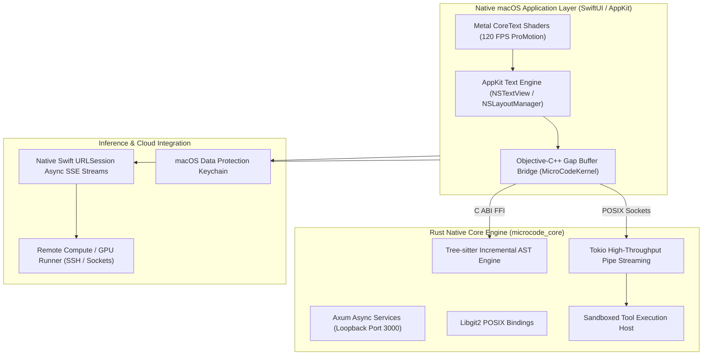
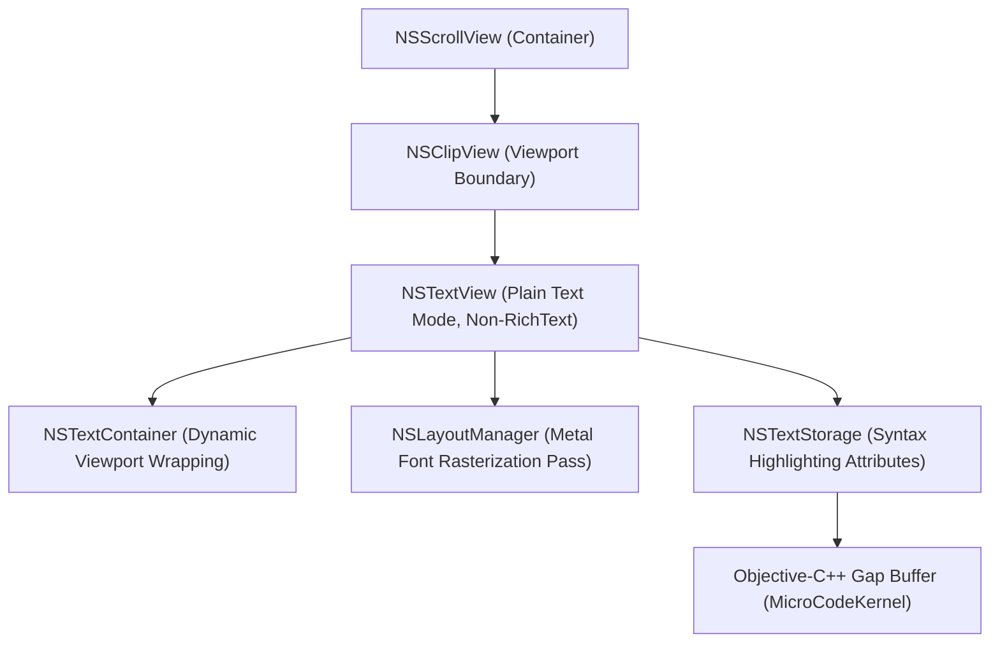
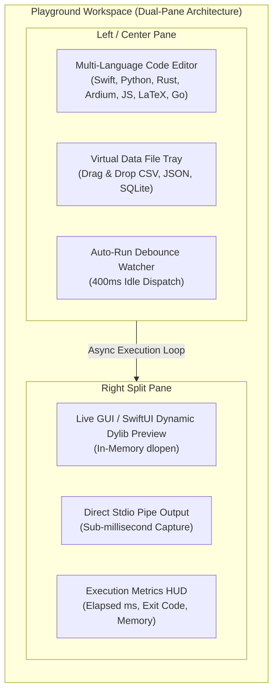
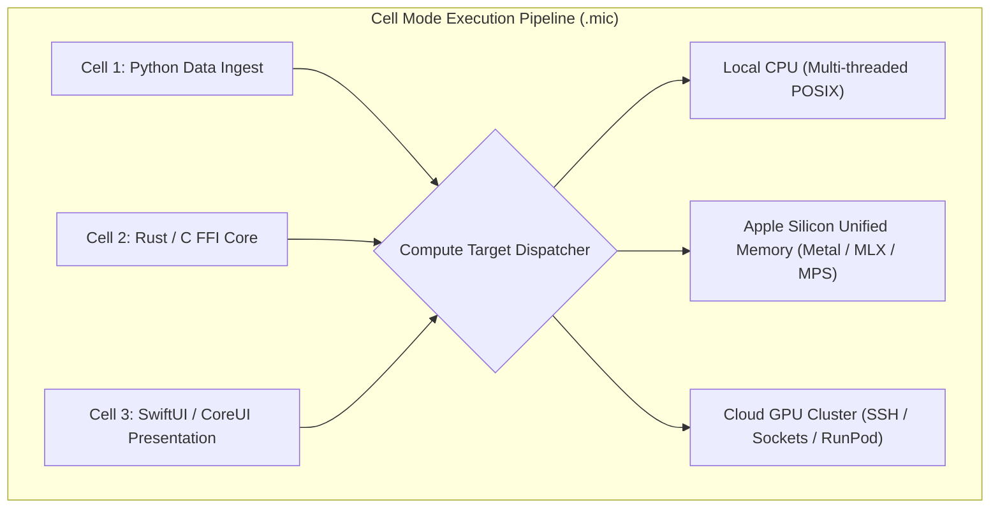

# MicroCode Developer Documentation

> **Native AI Workstation & Polyglot Development Environment for macOS**  
> *Architectural Specification, Engine Internals & Operational Modes*  
> Document Version: 2.3.1 | Classification: Apple Developer Technical Documentation  
> Copyright © 2024–2026 Dotmini Company Limited. All rights reserved.  
> Elastic License v2.0 (ELv2)

---

## Table of Contents

1. [Platform Architecture & Tech Stack](#1-platform-architecture--tech-stack)
2. [Editor Mode (Authentic IDE Core)](#2-editor-mode-authentic-ide-core)
3. [Playground Mode (Instant Interactive REPL) & `.microplay`](#3-playground-mode-instant-interactive-repl--microplay)
4. [Cell Mode & Notebook Engine (`.mic`)](#4-cell-mode--notebook-engine-mic)
5. [Autonomous AI Agent Mode (Agentic Workstation)](#5-autonomous-ai-agent-mode-agentic-workstation)
6. [Comparative Developer Matrix](#6-comparative-developer-matrix)
7. [API & Extension Protocols](#7-api--extension-protocols)
8. [Security Architecture & Permissions](#8-security-architecture--permissions)

---

## 1. Platform Architecture & Tech Stack

MicroCode is engineered from the ground up as a pure native macOS application. It strictly avoids Electron, Chromium Embedded Framework (CEF), WebKit DOM wrappers, and Node.js-based rendering layers for its primary editor and runtime loop.

### System Topology



### Core Technologies

| Subsystem | Technology | Implementation Responsibility |
|:---|:---|:---|
| **User Interface** | Swift 5.9+, SwiftUI, AppKit | High-performance desktop UI, native menu bar, sheets, HUD overlays, fluid multi-pane splitters, responsive window sizing. |
| **Typography & Layout** | CoreText, `NSTextLayoutManager`, Metal | Glyph vectorization, hardware-accelerated syntax highlight color passes, sub-pixel positioning, native font ligatures. |
| **High-Performance Buffer** | Objective-C++ (`MicroCodeKernel`) | Memory gap buffer algorithm for multi-gigabyte file manipulation with O(1) local cursor insertion/deletion complexity. |
| **Compiler & Execution Host** | Rust 1.75+ (`Tokio`, `Axum`) | Sandboxed process runner, incremental Tree-sitter parser, high-throughput stdin/stdout pipe streaming, language server protocol (LSP) multiplexer. |
| **AI Inference & ACP Hub** | Native Swift Networking (`URLSession`) | Multi-provider streaming SSE (Server-Sent Events) clients with zero intermediate proxy latency, async Keychain credential access, and adaptive backoff retry. |
| **Graphics & Device Emulation** | Metal (`MTKView`), CoreVideo, AVFoundation | 120 Hz ProMotion device frame rendering, iOS Simulator H.264 video decoding, Android ADB Scrcpy frame buffer compositing. |

---

## 2. Editor Mode (Authentic IDE Core)

The **Editor Mode** (`.code`) represents MicroCode's primary polyglot code editing environment, tailored for high-velocity software engineering across 30+ programming languages including Swift, Rust, C/C++, Ardium, TypeScript, Go, Python, and Zig.

### View Hierarchy & Layout Pipeline



### Key Architectural Advantages

1. **Sub-Millisecond Keystroke Latency**:
   Unlike web-based editors that dispatch keyboard events through a JavaScript event loop, DOM diffing engine, and Chromium compositor, MicroCode routes input directly through `NSResponder` to the native AppKit text storage stack.
2. **Zero Memory Bloat**:
   Idle footprint is **<80 MB RAM**, compared to **400 MB–1.2 GB** for Electron alternatives (VS Code, Cursor).
3. **Ghost Text & Inline AI Suggestions**:
   Integrated `AuthenticEditor+GhostText.swift` renders multi-line speculative completions as native grayed-out glyph attachments without mutating the underlying document undo stack until accepted via `Tab`.
4. **Objective-C++ Gap Buffer**:
   Files exceeding hundreds of megabytes do not cause UI lockups. Edits are handled in an optimized contiguous memory buffer that moves with cursor locality.

---

## 3. Playground Mode (Instant Interactive REPL) & `.microplay`

**Playground Mode** (`PlaygroundView.swift`) is an interactive rapid prototyping scratchpad inspired by Swift Playgrounds and modern REPL workstations. It allows developers to test algorithms, experiment with APIs, evaluate mathematics, and preview user interfaces without managing project manifests, build configs, or disposable files on disk.

Playground sessions can be saved and shared via the **`.microplay`** document format.

### Workspace Layout Organization



### Document Specification: `.microplay` Format

The `.microplay` file format serializes the entire scratchpad state, multi-language snippets, execution caches, and collapsed cell metadata into a clean JSON structure:

```json
{
  "version": 1,
  "id": "A4B72C91-03D8-4E82-B2A8-3E83626DFA55",
  "name": "QuickPrototype.microplay",
  "mode": "playground",
  "cells": [
    {
      "id": "890E024F-8AC0-4C3D-B91F-728DF9B7EC3B",
      "type": "code",
      "language": "swift",
      "content": "import SwiftUI\n\nstruct PreviewView: View {\n    var body: some View {\n        Text(\"Hello, Playground!\")\n    }\n}",
      "output": "",
      "colorTheme": "blue",
      "isCollapsed": false
    }
  ]
}
```

### Core Features

* **Multi-Language REPL Host**:
  Instantly switches environments between Python, Swift, Rust, Ardium, JavaScript/TypeScript, Go, C++, LaTeX, and Markdown without re-launching the workspace.
* **Dynamic SwiftUI Dylib Live Preview**:
  Compiles Swift snippets in-memory into temporary dynamic libraries (`.dylib`), loaded into the host process address space via `dlopen()` to render live SwiftUI components with interactive touch events and sub-second compilation.
* **Auto-Run with Debounced Dispatch**:
  Monitors code changes and schedules async execution after 400ms of user typing idle, providing instantaneous feedback.
* **Virtual Data Tray**:
  Developers can drag and drop CSV, JSON, PNG, or SQLite files into the `DataFilesPanel`. MicroCode automatically generates variable bindings (e.g., `data_sales_csv`) referencing isolated sandbox URLs.
* **Embedded Graphics Engine**:
  Native support for rendering Python `matplotlib`/`seaborn` plots, LaTeX math formulas via KaTeX, and Markdown previews directly within the unified UI pane.

---

## 4. Cell Mode & Notebook Engine (`.mic`)

**Cell Mode** transforms MicroCode into a polyglot computational notebook environment. Structured around `NotebookView.swift` and `PlaygroundCellView.swift`, it is powered by MicroCode's proprietary highly-compressed notebook storage format: **`.mic`** (`MicFormat.swift`).

Unlike sluggish browser-based Jupyter Notebooks (`.ipynb`) that run on heavy webviews, Cell Mode executes on native AppKit/Metal pipelines with instant file persistence and crash-recovery snapshots.

### Cell Execution & Hardware Routing



### Document Specification: `.mic` Format

The `.mic` format (`MicNotebook` & `MicCell`) stores cells, execution history, outputs, execution order numbers, metadata, and bound data assets:

```json
{
  "version": 1,
  "id": "7B21E534-1065-4CD8-87A4-9118534EC819",
  "name": "MachineLearningPipeline.mic",
  "createdAt": "2026-09-15T09:30:00Z",
  "modifiedAt": "2026-09-15T10:05:22Z",
  "cells": [
    {
      "id": "1D94C381-80DF-4395-9502-3D2483592FE3",
      "type": "code",
      "language": "python",
      "content": "import mlx.core as mx\na = mx.ones((1000, 1000))\nprint(a.shape)",
      "output": "[1000, 1000]\n",
      "executionCount": 1,
      "colorTheme": "emerald",
      "isCollapsed": false,
      "generatedCode": ""
    }
  ],
  "dataFiles": [
    {
      "name": "dataset.parquet",
      "path": "/Users/dotmini/Data/dataset.parquet",
      "type": "parquet",
      "size": 15482900
    }
  ]
}
```

### Capabilities & Compute Targets

1. **Hardware-Aware Compute Target Routing**:
   Individual cells can be dispatched to specific hardware targets via the cell header:
   * **Local CPU**: Standard multi-threaded execution.
   * **Apple Silicon (NPU/Metal)**: Routes tensor and matrix workloads to M-series unified memory via Apple MLX and Metal Performance Shaders (MPS).
   * **Remote Cloud GPU**: Transparently offloads long-running AI or scientific jobs over SSH / Unix sockets to remote GPU pods.
2. **Jupyter Interoperability**:
   Full bidirectional conversion: export any `.mic` document to standard `.ipynb` (Jupyter Notebook) for sharing with legacy teams, or import `.ipynb` files into `.mic` with zero format degradation.
3. **Autosave & Crash-Resilient Storage**:
   Maintains a real-time `autosave.mic` working snapshot and background flush to prevent work loss during hardware reboots or power events.
4. **Visual Cell Color Themes**:
   Supports organizational tagging (`.blue`, `.green`, `.purple`, `.amber`, `.ruby`) for clear visual demarcation of data acquisition, transformation, model training, and reporting phases.

---

## 5. Autonomous AI Agent Mode (Agentic Workstation)

**Autonomous AI Agent Mode** (`AIAgentView.swift` & `AgentService.swift`) is a sovereign client-side agent harness designed for multi-file code synthesis, autonomous refactoring, architectural migrations, and runtime self-healing.

### Autonomous Agent Lifecycle

```mermaid
sequenceDiagram
    autonumber
    actor Developer
    participant Agent as Autonomous Agent Supervisor
    participant AST as Tree-sitter RepoMap
    participant Gate as ⌘↵ Tool Approval Barrier
    participant Sandbox as Execution Sandbox

    Developer->>Agent: Define Feature / Task Goal
    Agent->>AST: Query Project Graph & Dependency Symbols
    AST-->>Agent: Symbol Topology & File Callers
    Agent->>Agent: Formulate Phased Implementation Plan
    Agent-->>Developer: Present Structured Plan & Proposed Tool Actions
    
    rect rgb(30, 30, 40)
        Note over Developer,Gate: Security & Authorization Boundary
        Developer->>Gate: Confirm Execution via ⌘↵ Shortcut
        Gate-->>Sandbox: Authorize File Mutation / Shell Execution
    end

    Sandbox->>Sandbox: Execute Tool Calls (Diff Patch / Build Verify)
    Sandbox-->>Agent: Return Tool Results, Compiler Lints, Exit Codes
    Agent->>Agent: Inspect Diagnostics & Auto-Heal Failures
    Agent-->>Developer: Present Final Verified Codebase & Summary Walkthrough
```



### Architectural Distinctions

#### 1. Zero Middleman Proxying & Direct Streaming
MicroCode connects natively from the developer's macOS workstation to 7 Tier-1 AI providers via async SSE streams. Token transport occurs directly over TLS with zero markup, zero telemetry inspection, and zero middleman servers:
* **Google Gemini**: Gemini 2.5 Pro / Flash & 3.1 Thinking via SSE stream parser.
* **Anthropic Claude**: Claude Opus 4.7 & Sonnet 4 with `2024-10-22` protocol, extended thinking, and prompt caching.
* **OpenAI**: GPT-5, o3-mini, and GPT-4o native connections.
* **DeepSeek**: DeepSeek V3 and R1 reasoning engines.
* **xAI Grok, Alibaba Qwen, Zhipu GLM, and Local Ollama**.

#### 2. The `⌘↵` Tool Approval Barrier
Unlike competing agent tools that indiscriminately overwrite files or run shell commands in the background, MicroCode enforces an ironclad security barrier. Tools that mutate disk or run processes pause execution and present the diff visually until explicitly authorized by the developer with `⌘↵`.

#### 3. Sovereign Tool Execution Sandbox (`AgentToolBox.swift`)
The agent communicates through a structured, statically-typed tool catalog:
* `file_write` / `replace_file_content`: Precision line-bounded replacements with pre-validation against line-hash drift.
* `file_read` / `multi_file_read`: Direct UTF-8 filesystem stream reader with truncation guards.
* `grep_search` / `find_by_name`: High-speed ripgrep and fd search directly inside the workspace.
* `shell`: Sandboxed command runner reporting process exit codes, stdout, and stderr.

#### 4. Sub-Agent Orchestrator & Task Swarm
MicroCode supports spawning specialized parallel sub-agents (e.g., Codebase Researcher, Database Debugger, Test Runner). Sub-agents execute concurrently in isolated context windows and report syntheses back to the primary supervisor agent.

---

## 6. Comparative Developer Matrix

| Metric / Capability | MicroCode v2.3.1 | Cursor / Windsurf | VS Code | Xcode 16 |
|:---|:---|:---|:---|:---|
| **Core Architecture** | **Swift + AppKit + Metal + Rust** | Electron + Chromium | Electron + Chromium | Native AppKit / Cocoa |
| **Cold Startup Time** | **< 0.8 seconds** | 3.5 – 6.0 seconds | 2.5 – 5.0 seconds | 8.0 – 20.0 seconds |
| **Idle Memory Consumption**| **~80 MB** | 650 MB – 1.4 GB | 450 MB – 950 MB | 1.2 GB – 3.0 GB |
| **Font Rasterization** | **Metal GPU + CoreText** | Chromium Canvas / WebGL | Chromium DOM | CoreText |
| **Playground Format** | **`.microplay` (In-Memory / JSON)** | None (File required) | None (Plugin required)| `.playground` (Xcode proprietary) |
| **Cell / Notebook Format**| **`.mic` (Native Compressed) + `.ipynb`** | `.ipynb` via webview | `.ipynb` via webview | None |
| **Tool Approval Gate** | **Strict `⌘↵` Barrier** | Partial / Opt-in | None | N/A |
| **AI Credential Storage** | **macOS Keychain (Encrypted)** | Plaintext config files | Plaintext JSON | Apple ID Keychain |
| **Third-Party Telemetry**| **Zero (Direct LLM Calls)** | Cloud-routed proxy | Microsoft Telemetry | Apple Analytics |

---

## 7. API & Extension Protocols

MicroCode provides low-latency FFI and IPC interfaces for external developer integration:

### 1. Agent Context Protocol (ACP)
Allows custom developer processes, MCP servers (Model Context Protocol), or local AI agents to interface with the MicroCode active buffer:
```swift
// Example: Querying MicroCode Active Editor Context via ACP
let bridge = AgentContextProtocolBridge.shared
let activeContext = try await bridge.captureCurrentContext()
print("File: \(activeContext.filePath), Selection: \(activeContext.selectedRange)")
```

### 2. MicroCode Kernel C ABI
For embedded plugins and high-throughput extensions written in C, C++, or Rust:
```c
#include "MicroCodeKernel.h"

// Initialize high-speed text gap buffer
MicroCodeBuffer* buffer = mc_buffer_create(1024 * 1024);
mc_buffer_insert_utf8(buffer, 0, "fn main() { return 0; }");
mc_buffer_destroy(buffer);
```

---

## 8. Security Architecture & Permissions

* **macOS Keychain Integration**:
  All API keys (Gemini, Anthropic, OpenAI, DeepSeek, Dotmini Cloud Tokens) are stored directly in the macOS Data Protection Keychain under service identifier `com.dotmini.microcode.subscription`. Credentials are never serialized to `.json` or `.plist` files on the user's hard drive.
* **Workspace Sandboxing**:
  Agent filesystem operations are strictly validated against canonicalized workspace root paths, preventing directory traversal attacks (`../../`).
* **Hardened Runtime**:
  MicroCode is compiled with Apple Hardened Runtime, signed with Apple Development / Developer ID certificates, and complies with macOS Gatekeeper notarization standards.

---

*Authored by Dotmini Engineering Team.*  
*For questions, issue reports, or enterprise licensing, visit [Dotmini Official Portal](https://dotmini.net).*
