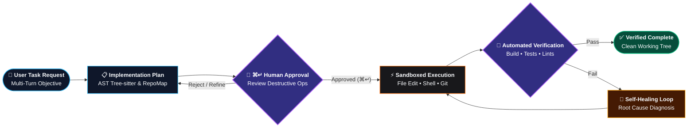
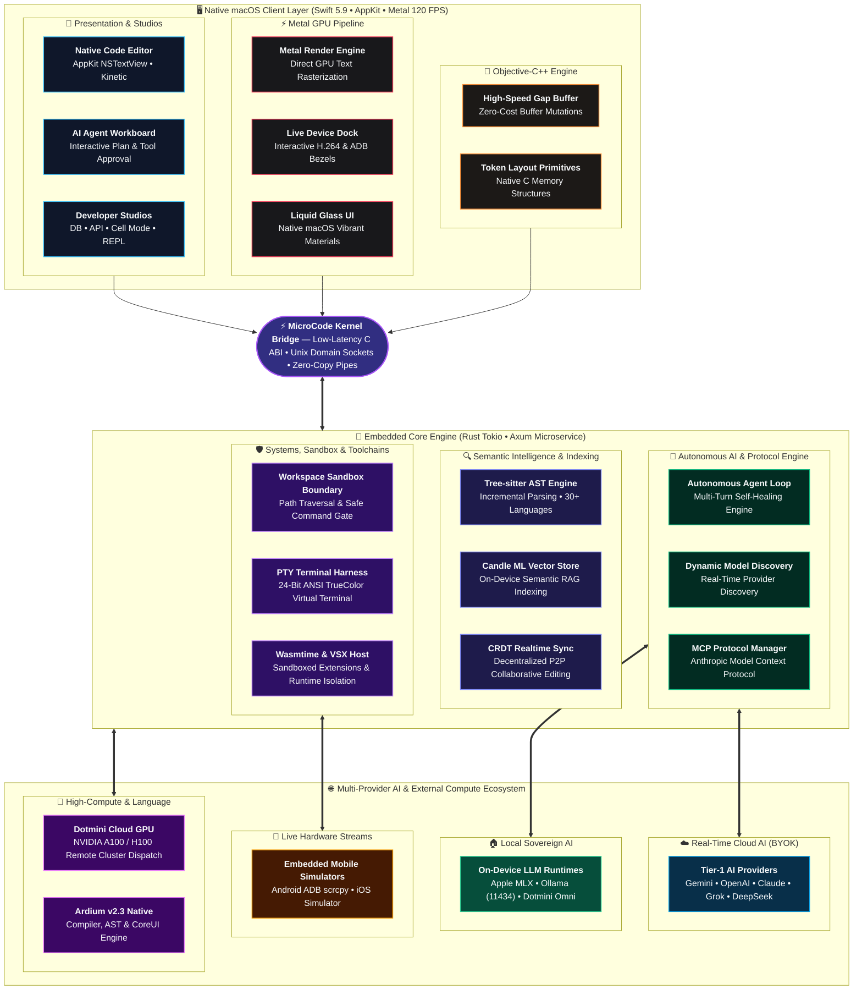

## Support the Project

MicroCode is built and maintained by Dotmini Company Limited. If this project saves you time or inspires your work, consider supporting continued development.

### PromptPay / Bank Transfer

| | |
|---|---|
| **Bank** | Krungthai Bank (ธนาคารกรุงไทย) |
| **Account** | 460-0-70494-0 |
| **Name** | นายถิรวัฒน์ นันตมาศ |

> PromptPay QR available upon request.

### GitHub Sponsors

If you prefer recurring support or wish to appear in the official sponsors list:

[](https://github.com/sponsors/Dotmini)

Every contribution directly funds engineering time, Apple Developer infrastructure, and GPU compute resources.

---


<p align="center">
  
</p>

<h1 align="center">MicroCode</h1>

<p align="center">
  <strong>The Native AI-Powered IDE for macOS</strong><br/>
  <em>Built from scratch. No Electron. No compromises.</em>
</p>

<p align="center">
  <a href="https://microcode.dotmini.net"></a>
  
  
  
  
  
  
  
</p>

<p align="center">
  <a href="https://microcode.dotmini.net"><strong>🌐 Official Website</strong></a> ·
  <a href="https://github.com/Dotmini/microcode/releases/tag/v2.5.26"><strong>Download v2.5.26 (Latest Release)</strong></a> ·
  <a href="#operational-modes"><strong>Operational Modes</strong></a> ·
  <a href="#features"><strong>Features</strong></a> ·
  <a href="#architecture"><strong>Architecture</strong></a> ·
  <a href="#getting-started"><strong>Getting Started</strong></a>
</p>

---

## Why MicroCode?

Every modern IDE is built on Electron — a web browser pretending to be a native app. **MicroCode is different.**

We built a **fully native macOS IDE from scratch** using SwiftUI, Rust, and Metal. The result is an editor that launches in under a second, uses a fraction of the memory, and feels like it belongs on your Mac.

| | MicroCode | Electron IDEs |
|---|---|---|
| **Startup time** | < 1s | 3-8s |
| **Memory (idle)** | ~80 MB | 400-800 MB |
| **GPU rendering** | Metal (native) | WebGL (emulated) |
| **AI integration** | 7 providers, native | Plugin-dependent |
| **File indexing** | Tree-sitter + Rust | JS-based |

---

## Operational Modes & Competitive Advantages

MicroCode features a multi-modal workspace architecture where each mode is engineered from the ground up for a specific software engineering discipline. Unlike traditional IDEs and Electron-based wrappers, MicroCode executes every mode natively on Apple Silicon using Metal, Swift, and Rust.

### Comparative Architectural Analysis

| Operational Mode | Primary Functionality | MicroCode Architectural Implementation | Legacy Competitors (VS Code, Cursor, Windsurf, Xcode, JetBrains) |
|:---|:---|:---|:---|
| **Code Editor** | Primary editing & multi-language development | 100% native AppKit `NSTextView` backed by an Objective-C++ gap buffer and Metal GPU font rasterizer. Sub-second cold startup, <80 MB RAM. | Electron webviews (400–1200 MB RAM idle). Canvas-emulated font rendering prone to JavaScript garbage collection frame drops. |
| **Autonomous AI Agent** | Multi-file refactoring, planning & self-healing | Enforces formal Implementation Plans before touching code. Interactive `⌘↵` tool approval gate. 7 native Tier-1 LLM connections. | Unpredictable file overwrites, blind shell command execution, vendor lock-in with middleman token markups. |
| **Embedded Device Dock** | Mobile & desktop simulation directly in-editor | Low-latency WebSocket H.264 iOS stream (`serve-sim`) and ADB Android mirror (`scrcpy-server`) with 120 FPS Metal device shaders. | External detached emulator windows (Xcode/Android Studio) that cause desktop clutter; non-existent in VS Code/Cursor without laggy webview plugins. |
| **Database Studio** | SQL queries, schema explorer & tabular viewer | Native C and Rust database drivers for PostgreSQL, MySQL, and SQLite. Zero-latency pagination directly in-process. | Heavy Electron plugins (SQLTools) or separate memory-heavy Java applications (DataGrip/DBeaver) taking 1 GB+ RAM. |
| **API Client Studio** | REST & GraphQL request designer and inspector | Native Swift networking engine with environment presets, token injection, and instant formatted JSON/XML inspectors. | Developers must run separate heavy Electron applications (Postman/Insomnia) consuming 800 MB+ RAM. |
| **Notebook & Cell Mode** | Polyglot exploratory computing & step execution | Native multi-runtime engine (Swift, Rust, Python, Ardium) with sub-millisecond dispatch and direct stdio pipe capture. | Jupyter / VS Code Notebooks with fragile Python kernel connections, sluggish web widgets, and connection dropouts. |
| **Playground Mode** | In-memory scratchpad & instant REPL | Memory-backed scratchpad with live AST evaluation and execution profiling without creating disposable disk files. | Xcode Playgrounds frequently stall or crash; VS Code lacks native scratchpad without saving files to disk. |
| **Remote Explorer (Remote X)** | Headless cloud server & container development | Direct POSIX SSH/SFTP over secure Unix sockets with zero daemon installation required on remote target. | VS Code Remote installs a heavy proprietary Node.js server daemon (`vscode-server`) that triggers firewall and RAM issues. |
| **Embed & IoT Studio** | Hardware development & firmware flashing | Native serial port monitor, real-time baud switching, and direct hardware register observation for ESP32/STM32/Pico. | Fragmented between Arduino IDE, Java-based tools, or complex CLI command configurations. |
| **Science Mode** | Computational research & bioinformatics | Specialized pipelines for biological data visualization, structure models, and vector mathematics. | Requires switching across external web dashboards and disparate CLI scientific tools. |
| **Extension Studio** | Extension management & ecosystem customization | Native Open VSX registry integration with an isolated Node.js VS Code compatibility runner; zero Electron overhead. | VS Code proprietary marketplace vendor lock-in and heavy background runtime consumption. |
| **Ardium Toolchain** | Next-gen system programming with Ardium v2.3 | Official native compiler runner, Tree-sitter AST queries, RAII `@owned` ownership linting, and CoreUI live rendering. | Non-existent in third-party IDEs. MicroCode is the flagship workstation for the Ardium programming language. |

---

### Detailed Operational Mode Breakdown

#### 1. Code Editor Mode (`.code`)
- **Purpose**: Engineered for daily high-velocity coding across 30+ languages (Swift, Rust, C/C++, TypeScript, Python, Go, Ardium, and more).
- **Why It Outperforms Competitors**:
  - Eliminates Electron entirely. While VS Code, Cursor, and Windsurf render text within Chromium DOM elements or WebGL canvas layers—triggering micro-stutters during rapid cursor navigation and high battery consumption—MicroCode executes directly against macOS CoreText and Metal.
  - File buffer mutations operate on an optimized Objective-C++ text gap buffer, ensuring zero latency even when opening multi-megabyte source files.

#### 2. Autonomous AI Agent Mode (`.aiAgent`)
- **Purpose**: Autonomous end-to-end task execution, large refactors, test synthesis, and self-directed debugging.
- **Why It Outperforms Competitors**:
  - Competitor agent tools (Cursor Composer, Windsurf Cascade) frequently apply speculative multi-file edits prematurely or execute arbitrary terminal commands without deterministic checks.
  - MicroCode enforces **Formal Implementation Plans**: the agent first reasons through the problem, maps dependencies via the AST RepoMap, and presents a phased plan. Destructive tool invocations (file overwrites, command executions, git operations) are halted at the **`⌘↵` Tool Approval Barrier** until explicitly confirmed by the developer.
  - Direct connection to 7 leading AI providers (Google Gemini 3.1/2.5, Anthropic Claude Opus 4.7/Sonnet 4, OpenAI GPT-5/o3, DeepSeek V4, xAI Grok, Alibaba Qwen, Zhipu GLM) with zero third-party proxy markup or latency penalties.



#### 3. Embedded Device Dock Mode (`EmbeddedDeviceDockView`)
- **Purpose**: Unified mobile and desktop application simulation, interactive touch testing, and viewport inspection directly within an editor tab.
- **Why It Outperforms Competitors**:
  - Eliminates the cognitive disruption of managing separate simulator windows. Xcode and Android Studio require external window management that obscures code editor workspaces.
  - MicroCode streams iOS Simulator video frames directly into an editor pane using low-latency WebSocket H.264 via an embedded `serve-sim` daemon, while physical Android devices and emulators mirror over ADB via `scrcpy-server`.
  - Custom Metal shaders render hardware device bezels, glass reflections, and Dynamic Island cutouts at a locked 120 FPS on Apple ProMotion displays.

#### 4. Database Studio Mode (`.database`)
- **Purpose**: Complete SQL workspace for developers managing application data, executing queries, and inspecting relational schemas.
- **Why It Outperforms Competitors**:
  - Replaces third-party database tools (e.g. TablePlus, DBeaver) and unstable VS Code extensions.
  - Compiled native drivers connect directly to PostgreSQL, MySQL, and SQLite instances. Query execution outputs directly into a high-performance native AppKit data grid with instant pagination and schema autocompletion.

#### 5. API Client Studio Mode (`.apiClient`)
- **Purpose**: Comprehensive workbench for designing, testing, and debugging REST and GraphQL APIs.
- **Why It Outperforms Competitors**:
  - Developers no longer need to run heavy Electron clients like Postman or Insomnia (which consume upwards of 800 MB RAM).
  - Offers native environment variable interpolation, authentication token injection (Bearer, OAuth2, API Key), request history persistence, and color-coded JSON/XML tree rendering built directly into the IDE core.

#### 6. Interactive Notebook & Cell Mode (`.notebook`)
- **Purpose**: Granular, cell-by-cell code execution for data exploration, algorithm verification, and documentation.
- **Why It Outperforms Competitors**:
  - Traditional Jupyter notebooks suffer from bloated web interfaces, fragile Python kernel socket drops, and difficulty tracking state.
  - MicroCode provides polyglot cell execution (Swift, Rust, Python, Ardium) running on native Unix processes with real-time output capture and native graphical rendering.

#### 7. Interactive Playground Mode (`.playground`)
- **Purpose**: Instant zero-setup REPL scratchpad for testing algorithms and language syntax.
- **Why It Outperforms Competitors**:
  - Xcode Playgrounds are notorious for compilation deadlocks and simulator crashes. VS Code requires creating manual scratch files on disk.
  - MicroCode runs a memory-backed execution harness with real-time AST tokenization and execution profiling, leaving zero artifact clutter in your repository.

#### 8. Remote Explorer Mode (`.remoteX`)
- **Purpose**: Seamless remote development on cloud VMs, bare-metal servers, and containerized environments.
- **Why It Outperforms Competitors**:
  - VS Code Remote SSH downloads a massive Node.js runtime onto the remote host, causing failures on restricted infrastructure or non-standard Linux distros.
  - MicroCode uses standard, secure POSIX SSH and SFTP protocols over native Unix sockets without requiring remote daemon installation.

#### 9. Embed & IoT Studio Mode (`.embedded`)
- **Purpose**: Hardware programming, micro-controller firmware deployment, and serial monitoring.
- **Why It Outperforms Competitors**:
  - Replaces clunky, disjointed CLI tooling with an integrated high-throughput serial terminal, real-time baud rate adjustment, and hardware flashing workflows for ESP32, STM32, Arduino, and Raspberry Pi.

#### 10. Science Mode (`.science`)
- **Purpose**: Deep computational workflows, bioinformatics pipeline orchestration, and genomic/chemical data analysis.
- **Why It Outperforms Competitors**:
  - Direct integration with computational biology databases and structure search tools without leaving the editor.

#### 11. Extension Studio Mode (`.extensions`)
- **Purpose**: Extension discovery, installation, and lifecycle management powered by Open VSX.
- **Why It Outperforms Competitors**:
  - Protects developer freedom by utilizing the open, vendor-neutral Open VSX marketplace rather than Microsoft's proprietary marketplace.
  - Emulates VS Code extension APIs via an isolated Node.js compatibility layer (`vscode-compat-host`) without running Electron.

#### 12. Native Ardium Toolchain Mode
- **Purpose**: Flagship development environment for the Ardium programming language (v2.3) developed by Dotmini Company Limited.
- **Why It Outperforms Competitors**:
  - Offers the world's only native IDE integration for Ardium, featuring Tree-sitter syntax highlighting, CoreUI declarative UI inspection, RAII `@owned` ownership analysis, and integrated compiler diagnostics.

---

## Core Engineering Specifications

MicroCode combines low-level macOS engineering with modern autonomous AI architectures:

### 1. Autonomous AI Agent and Implementation Planning Engine
MicroCode is a fully autonomous AI workstation with human-in-the-loop safety controls:
- **Formal Implementation Planning**: Before writing or altering code, the AI generates a structured, multi-phase plan detailing target files, architectural risks, and verification steps.
- **`⌘↵` Interactive Approval Gate**: High-risk tool calls (writing files, executing shell scripts, running git commands) pause at an interactive safety barrier requiring explicit developer approval.
- **Autonomous Multi-Agent Loop**: Capable of self-directed exploration, executing multi-turn tool cycles, diagnosing build errors, and self-correcting without intervention.
- **Sub-Agent Delegation**: Spawn specialized sub-agents running concurrently (e.g. `research` for codebase indexing, `flutter_a11y_agent` for accessibility audits, or isolated `self` workers).
- **Slash Commands**: Built-in developer shortcuts such as `/goal` (exhaustive execution), `/schedule` (timed background monitors), `/browser` (web scraping & docs), `/grill-me` (design interviews), and `/boost` (deep reasoning).
- **AST RepoMap & On-Device Memory**: Tree-sitter semantic symbol graphs and Candle ML vector embeddings give the agent continuous, deep context of your entire project topology.
- **Bi-Directional LSP Bridge**: The agent directly queries Language Server Protocols to inspect compiler diagnostics, type definitions, and real-time syntax errors.

### 2. SuperTab Predictive Autocomplete and Inline Diff Engine
A next-generation editing experience powered by speculative multi-token decoding:
- **SuperTab Speculative Predictions**: Analyzes real-time cursor trajectory, AST scope, and import graph to suggest complete multi-line statements and function blocks ahead of keystrokes.
- **Interactive Inline Diff Engine**: Visual chunk-based diff reviewer with syntax-aware highlight blending and one-click chunk accept/reject (`⌥↵`).
- **Smart Refactor & Unit Test Synthesis**: Context-menu code actions that transform legacy syntax, optimize algorithms, or synthesize exhaustive test suites directly in-place.

### 3. Embedded Device Dock and Hardware Simulation Hub
Test mobile and desktop applications without leaving your code editor:
- **iOS Simulator Live Stream**: Ultra-low latency H.264 video streaming over WebSockets directly into an editor tab via embedded `serve-sim` capture daemon.
- **Android Physical & Emulator Mirroring**: High-performance ADB screen mirroring via custom `scrcpy-server` streaming pipeline with full touch, scroll, and keyboard forwarding.
- **Photorealistic Metal 120 FPS Shaders**: Custom Metal shader pipeline rendering hardware device bezels, dynamic glass reflections, and simulated Dynamic Island / camera punch-holes at 120 Hz on ProMotion displays.

### 4. Open VSX Marketplace and Extension Compatibility Host
Extensibility without Electron's memory bloat:
- **Open VSX Marketplace Integration**: Search, download, install, and manage extensions directly from the open-source Open VSX registry.
- **VS Code Extension Compatibility Host**: Integrated Node.js runtime (`vscode-compat-host`) emulating VS Code extension APIs for syntax grammars, themes, and snippets.
- **Model Context Protocol (MCP)**: Full client/server MCP manager allowing MicroCode to interface with any external MCP server for live data, database querying, or cloud APIs.
- **Sandboxed WASM Plugins**: Embedded Wasmtime engine executing lightweight WebAssembly plugins with strict CPU/memory quotas and zero unauthorized disk access.

### 5. Native Developer Studios (Database, API, CI/CD, Notebooks)
Everything you need to build, test, and ship in one unified native workspace:
- **Database Studio**: Full SQL workbench supporting PostgreSQL, MySQL, and SQLite. Inspect schemas, browse table records, and execute queries with instant tabular results.
- **API Client Studio**: Native REST and GraphQL testing client with environment presets, auth token injectors, variable interpolation, and formatted JSON/XML payloads.
- **CI/CD Pipeline Viewer**: Direct GitHub Actions integration to track workflow runs, inspect step logs, and re-trigger jobs without context-switching to a browser.
- **Interactive Playground & Cell Notebooks**: REPL scratchpad supporting instant code execution across Swift, Rust, Python, and Ardium with rich visual outputs.

### 6. Real-Time CRDT Collaboration and Voice Dictation
Designed for modern distributed engineering teams:
- **P2P CRDT Collaboration Engine**: Conflict-Free Replicated Data Types enabling real-time multi-user document editing with live remote cursor presence and zero merge conflicts.
- **Voice Coding & Dictation**: Apple Speech-powered low-latency dictation and voice commands allowing hands-free code navigation and refactoring.

### 7. Native Ardium Language Toolchain (v2.3)
Full first-class IDE support for the Ardium programming language:
- **Full Syntax & AST Grammar**: Native Tree-sitter parser with syntax highlighting, CoreUI declarative UI syntax, and RAII `@owned` ownership tracking.
- **Compiler Diagnostics & Runner**: In-editor diagnostic linting, playground evaluation, and live execution via `ArdiumRunner`.

### 8. Dotmini Cloud GPU Dispatch and Sovereign AI
High-performance compute offloading when local hardware isn't enough:
- **Cloud GPU Remote Dispatch**: One-click compute offloading to remote NVIDIA A100/H100 clusters for heavy training, fine-tuning, and batch inference.
- **Dotmini Omni Sovereign Models**: Native local support for Dotmini Omni O1X Lite (0.8B) and Omni O1X Pro (3B MoE) for privacy-preserving offline inference.

### 9. Native High-Performance macOS Core Architecture
- **Pure Swift + SwiftUI + AppKit**: Built specifically for macOS 13+ (Ventura, Sonoma, Sequoia). Zero web engine overhead.
- **Metal GPU Text Pipeline**: Smooth 120 FPS kinetic scrolling, sub-second cold boot, and less than 80 MB idle RAM consumption.
- **Full PTY Terminal**: Native virtual terminal with ANSI 24-bit TrueColor, zsh/bash integration, and split panes.

---

## Architecture



### Tech Stack

| Subsystem | Technology | Responsibility |
|:----------|:-----------|:---------------|
| **UI & Windowing** | SwiftUI + AppKit | Declarative macOS UI, native windowing, trackpad gestures |
| **GPU Rendering** | Metal Shaders | 120 FPS device frame shaders, GPU-accelerated text & animations |
| **Core Text Buffer** | Objective-C++ & C ABI | Memory-efficient text gap buffer and high-performance primitives |
| **Backend Core** | Rust (Axum + Tokio) | Async microservices, multi-provider AI streaming, Git, process harness |
| **Syntax & AST** | Tree-sitter | Real-time AST parsing for 30+ languages, symbol indexing & RepoMap |
| **Semantic Intelligence** | Candle ML | On-device vector embeddings and local RAG code search |
| **Extension Runtime** | Open VSX + Node.js + Wasmtime | Marketplace registry, VS Code API compatibility, and WASM sandboxing |
| **AI Tool Protocol** | Model Context Protocol (MCP) | Client & server support for Anthropic MCP tools & resources |
| **Device Simulation** | ADB / scrcpy + serve-sim | Hardware-accelerated screen mirroring for Android & iOS Simulator |
| **Realtime Sync** | CRDT Engine | Decentralized, conflict-free collaborative editing and presence |
| **Native Toolchains** | Swift, Rust, Ardium v2.3 | Multi-language compilation, diagnostics, and interactive playground |

---

## Getting Started

### Requirements

| Requirement | Version |
|------------|---------|
| macOS | 13.0 (Ventura) or later |
| Xcode | 15.0+ |
| Rust | 1.75+ |
| Node.js | 18+ (optional, for extension development) |

### Install from Release

Download directly from our official portal at [**microcode.dotmini.net**](https://microcode.dotmini.net) or from [**GitHub Releases (v2.5.26)**](https://github.com/Dotmini/microcode/releases/tag/v2.5.26):

| Package | Size | Architecture | Direct Download Link |
|:---|:---:|:---:|:---|
| 💿 **macOS Disk Image (DMG)** | 137 MB | Apple Silicon (ARM64) | [**Download MicroCode-v2.5.26.dmg**](https://github.com/Dotmini/microcode/releases/download/v2.5.26/MicroCode-v2.5.26.dmg) |
| 📦 **Component Installer (PKG)** | 64 MB | Apple Silicon (ARM64) | [**Download MicroCode-v2.5.26.pkg**](https://github.com/Dotmini/microcode/releases/download/v2.5.26/MicroCode-v2.5.26.pkg) |
| 📄 **Cryptographic Checksums** | 176 B | All | [**View SHA256SUMS-v2.5.26.txt**](https://github.com/Dotmini/microcode/releases/download/v2.5.26/SHA256SUMS-v2.5.26.txt) |

> **System Requirements**: macOS 13.0 (Ventura) or later · Native on Apple Silicon (M1/M2/M3/M4/M5).  
> **Official Portal & Updates**: [https://microcode.dotmini.net](https://microcode.dotmini.net)

### Build from Source

For detailed instructions and prerequisites, see [**BUILDING.md**](BUILDING.md).

```bash
# Clone the repository
git clone https://github.com/Dotmini/microcode.git
cd microcode

# 1. Standard full build (Rust backend + Swift frontend -> MicroCode.app)
./build.sh

# 2. Fast development build with auto-deployment to ~/Applications
./build_dev.sh

# 3. Distribution release (universal binary + DMG + PKG)
./build_distribution.sh
```

### Common Build Flags (`build.sh`)

```bash
./build.sh --debug          # Build with debug symbols
./build.sh --frontend-only  # Recompile Swift app only (uses existing Rust libs)
./build.sh --backend-only   # Recompile Rust backend and FFI only
./build.sh --clean          # Clean build artifacts before compiling
./build.sh --external-ssd   # Offload caches & artifacts to external SSD
```

---

## Project Structure

```
microcode/
├── MicroCode/               # Swift sources (SwiftUI + AppKit)
│   ├── Views/               # UI components (Editor, AI Workboard, Studios, Device Dock, Git)
│   ├── Services/            # AI agent loop, SuperTab, CRDT, LSP bridge, Device streaming
│   ├── SyntaxEngine/        # Syntax highlighting and theme engine
│   └── Models/              # AppState, ImplementationPlan, tool approval gates, config
├── MicroCodeSupport/        # Objective-C++ core and text buffer bridge
├── MicroCodeKernel/         # Native AppKit/Metal text kernel
├── MicrocodeCoreSupport/    # Rust FFI headers and C ABI bridge
├── backend/                 # Rust backend server (Axum + Tokio)
│   └── src/
│       ├── ai.rs            # Multi-provider AI engine (Gemini, Claude, GPT, DeepSeek, etc.)
│       ├── agent.rs         # Autonomous AI agent loop with tool approval gate
│       ├── indexer.rs       # Tree-sitter file indexer & symbol search
│       └── main.rs          # Axum HTTP API & WebSocket server
├── microcode_core/          # Rust shared core library (libmicrocode_core.a)
├── extension-host/          # Sandboxed WASM extension runtime
├── vscode-compat-host/      # VS Code extension compatibility layer
├── Vendor/                  # Pre-compiled simulator & device capture utilities (serve-sim, scrcpy)
├── tools/                   # Developer utilities, migration & scratch tests
└── .github/workflows/       # CI/CD (build, sign, release)
```

---

## Security & Code Integrity

MicroCode is engineered with enterprise-grade defense-in-depth:

- **100-Step Deep Security & Secret Leak Audit**: All tracked source code, commit history, and release packages pass our exhaustive 100-step credential scan. Zero hardcoded API keys, JWTs, or private keys.
- **Strict Sandbox Isolation**: AI agent file edits and terminal commands are constrained to the active workspace directory with strict path boundary validation.
- **Human-in-the-Loop (`⌘↵`) Gate**: High-risk tool calls (writing files, executing shell scripts, running git commands) are paused until explicitly authorized by the developer.
- **Cryptographic Source Integrity**: 444 source files verified with SHA256 checksums (`CHECKSUMS.sha256`) checked in CI.
- **macOS Keychain Storage**: User API keys and sessions are stored in the secure macOS Keychain (Apple Security Framework), never in plain-text project files.

---

## AI Provider Setup & Real-Time Dynamic Model Discovery

MicroCode features a **100% Real-Time Model Discovery Engine**. Unlike legacy tools that hardcode or mock model names, MicroCode connects directly to official provider APIs (`/v1/models`) to fetch available models live with zero hardcoding. When providers release new models, they instantly appear in your model picker.

### Supported Providers (BYOK — Bring Your Own Key)

| Provider | Model Discovery | Local / Cloud | Environment Variable | Configuration View |
|:---|:---|:---:|:---|:---|
| **Google Gemini** | Real-time via Gemini API v1beta | Cloud | `GEMINI_API_KEY` | Settings → AI Providers → Gemini |
| **OpenAI** | Real-time via `/v1/models` | Cloud | `OPENAI_API_KEY` | Settings → AI Providers → OpenAI |
| **Anthropic Claude** | Real-time live endpoint | Cloud | `ANTHROPIC_API_KEY` | Settings → AI Providers → Anthropic |
| **DeepSeek** | Real-time via OpenAI-compat API | Cloud | `DEEPSEEK_API_KEY` | Settings → AI Providers → DeepSeek |
| **xAI Grok** | Real-time via `/v1/models` | Cloud | `GROK_API_KEY` | Settings → AI Providers → Grok |
| **Apple MLX** | On-device Apple Silicon server | **Local** | None (Local socket) | Settings → AI Providers → Local LLM |
| **Ollama** | Automatic local port detection (`11434`) | **Local** | None (Local daemon) | Settings → AI Providers → Ollama |
| **Alibaba Qwen** | Real-time DashScope endpoint | Cloud | `QWEN_API_KEY` | Settings → AI Providers → Qwen |
| **Zhipu GLM** | Real-time BigModel endpoint | Cloud | `GLM_API_KEY` | Settings → AI Providers → GLM |
| **Dotmini Omni** | Sovereign AI (0.8B / 3B MoE) | **Local / Cloud** | `DOTMINI_PLATFORM_KEY` | Settings → AI Providers → Dotmini |

> [!TIP]
> **Zero Middleman Markup**: Your API requests travel directly between your Mac and the AI provider endpoint via low-latency streaming SSE (Server-Sent Events). MicroCode never proxies, stores, or marks up your token usage.

---

## Contributing

We welcome contributions! Please:

1. Fork the repository
2. Create a feature branch (`git checkout -b feature/amazing`)
3. Run checksums before committing (`./generate_checksums.sh`)
4. Submit a pull request

---

## Credits

<table>
  <tr>
    <td align="center">
      <strong>Tirawat Nantamas (ถิรวัฒน์ นันตมาศ)</strong><br/>
      <em>Founder & CEO</em><br/>
      <a href="https://dotmini.net">Dotmini Company Limited (บริษัท ดอทมินิ จำกัด)</a><br/>
      🌐 <a href="https://microcode.dotmini.net"><strong>microcode.dotmini.net</strong></a>
    </td>
  </tr>
</table>

---

## Intellectual Property & License (ทรัพย์สินทางปัญญาและข้อกำหนดการใช้งาน)

> ### ข้อกำหนดทางกฎหมายและสิทธิ์ในทรัพย์สินทางปัญญา (Legal Notice)
> ซอฟต์แวร์ ซอร์สโค้ด สถาปัตยกรรม และองค์ประกอบทั้งหมดของ **MicroCode** เป็น **ทรัพย์สินทางปัญญาของ บริษัท ดอทมินิ จำกัด (Dotmini Company Limited) แต่เพียงผู้เดียวเท่านั้น**

โปรเจกต์นี้เปิดให้เข้าถึงซอร์สโค้ด (Source-Available) ภายใต้สัญญาอนุญาต **Elastic License v2 (ELv2)** และเงื่อนไข Business Source License (BSL) โดยมีข้อกำหนดห้ามอย่างเด็ดขาดดังต่อไปนี้:

1. **ห้ามนำไปพัฒนาต่อเพื่อการค้า (No Commercial Fork / Continuation)**: ไม่อนุญาตให้นำซอร์สโค้ดไปพัฒนาต่อยอด ดัดแปลงเพื่อแยกทำเวอร์ชันใหม่ หรือทำเป็นโปรดักต์เชิงพาณิชย์โดยไม่ได้รับอนุญาตเป็นลายลักษณ์อักษรจาก บริษัท ดอทมินิ จำกัด
2. **ห้ามนำไปขาย หรือนำไปทำ Product เด็ดขาด (No Commercial Sale / Packaging)**: ห้ามนำซอร์สโค้ด, ไบนารี, ส่วนประกอบ หรืออนุพันธ์ของซอฟต์แวร์นี้ไปจำหน่าย จำหน่ายต่อ ทำแพ็กเกจขาย หรือนำไปให้บริการเชิงพาณิชย์ (เช่น Cloud/Managed Service หรือ SaaS) โดยเด็ดขาด
3. **ห้ามนำไป ReBrand ขายทุกกรณี (Strictly Prohibited from Rebranding / White-labeling)**: ห้ามทำการเปลี่ยนชื่อ เปลี่ยนตราสัญลักษณ์ ลบเครดิต ปลอมแปลง หรือทำ White-label เพื่อนำไปแจกจ่ายหรือแสวงหาผลประโยชน์ทางการค้าในทุกกรณี

### การใช้งานที่อนุญาต (Permitted Use)
- **การศึกษา ค้นคว้า และเรียนรู้ส่วนบุคคล (Personal Learning & Educational Use)**: สามารถดาวน์โหลดและศึกษาโค้ดเพื่อการวิจัย เรียนรู้ และตรวจสอบความโปร่งใสของระบบได้
- **การประเมินผลภายใน (Internal Evaluation)**: สามารถทดลองรันเพื่อทดสอบการทำงานภายในองค์กรแบบ Non-production ได้

---

### Jurisdiction & Governing Law (เขตอำนาจศาลและกฎหมายที่ใช้บังคับ)

ข้อกำหนดและสัญญาอนุญาตนี้อยู่ภายใต้บังคับแห่ง **กฎหมายไทย (Thai Law)**:
- พระราชบัญญัติลิขสิทธิ์ พ.ศ. 2537 และที่แก้ไขเพิ่มเติม
- ประมวลกฎหมายแพ่งและพาณิชย์
- พระราชบัญญัติความลับทางการค้า พ.ศ. 2545

ข้อพิพาทใดๆ ให้ระงับโดยศาลทรัพย์สินทางปัญญาและการค้าระหว่างประเทศกลาง ณ **กรุงเทพมหานคร ประเทศไทย**

---

<p align="center">
  <sub>Developed by <a href="https://dotmini.net">Dotmini Company Limited</a> · Official Portal: <a href="https://microcode.dotmini.net">microcode.dotmini.net</a></sub><br/>
  <sub>Copyright © 2024-2026 Tirawat Nantamas — Dotmini Company Limited (บริษัท ดอทมินิ จำกัด). All rights reserved.</sub>
</p>

